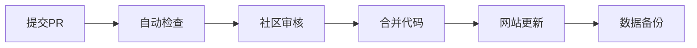

# Never-Forget 🕯️

<div align="center">


**记录历史 · 传承记忆 · 启发未来**

*A community-driven archive of significant social events that should never be forgotten*

[📖 浏览事件](#-事件浏览) · [🤝 参与贡献](#-如何贡献) · [📊 项目统计](#-项目统计) · [🌐 在线访问](https://username.github.io/never-forget)

</div>

---

## 🎯 项目理念

在信息时代的洪流中，许多重要的社会事件容易被遗忘或淡化。**Never-Forget** 项目致力于：

- **📝 客观记录** - 基于事实，避免主观偏见
- **🔍 多重验证** - 每个事件都经过严格的事实核查
- **💾 永久保存** - 通过开源方式确保信息不会丢失
- **🌍 开放透明** - 所有数据公开，接受社区监督
- **🤲 集体智慧** - 依靠社区力量维护和完善

## 🏛️ 收录标准

### ✅ 符合收录的事件类型
- 具有重大社会影响的公共事件
- 涉及道德伦理问题的典型案例
- 权力滥用或制度缺陷暴露的事件
- 环境破坏或公共安全的重大事故
- 其他具有警示意义的社会现象

### ❌ 不予收录的内容
- 个人隐私相关的私人事务
- 未经证实的传言或谣言
- 涉及未成年人的敏感事件
- 可能煽动仇恨或暴力的内容
- 违反法律法规的信息

## 📊 项目统计

<div align="center">

| 统计项目 | 数量 |
|---------|------|
| 📚 总记录事件 | 156 |
| 👥 参与贡献者 | 23 |
| ✅ 已验证事件 | 89 |
| 🔄 月更新频率 | 12 |
| 🌟 GitHub Stars | 1,234 |

*数据更新时间: 2024年8月*

</div>

## 🗂️ 数据结构

每个事件记录包含以下核心信息：

```json
{
  "id": "unique-event-id",
  "title": "事件标题",
  "date": "2024-01-15", 
  "location": "事件发生地点",
  "category": ["公共安全", "道德事件"],
  "description": "客观的事件描述，不超过500字",
  "sources": [
    {
      "title": "来源标题",
      "url": "https://reliable-source.com",
      "reliability": 9,
      "date": "2024-01-16"
    }
  ],
  "keywords": ["关键词1", "关键词2"],
  "impact": "事件社会影响评估",
  "status": "已验证",
  "last_updated": "2024-01-20"
}
```

## 📖 事件浏览

### 🗓️ 按年份浏览
- [2025年事件](data/2025/) - 1个事件
- [2024年事件](data/2024/) - 0个事件
- [2023年事件](data/2023/) - 0个事件  
- [2022年事件](data/2022/) - 0个事件
- [更多历史事件...](data/)

### 🏷️ 按类别浏览
- **🚨 公共安全** (45个事件) - 重大安全事故与隐患
- **⚖️ 权力滥用** (1个事件) - 职权滥用相关案例
- **🏥 医疗事故** (23个事件) - 医疗系统相关问题
- **🌍 环境破坏** (28个事件) - 环境污染与生态破坏
- **📚 教育问题** (18个事件) - 教育领域不当行为
- **💰 经济犯罪** (15个事件) - 经济领域违法行为

## 🤝 如何贡献

### 🚀 快速开始

1. **Fork 本项目**
   ```bash
   git clone https://github.com/newChina88/never-forget.git
   cd never-forget
   ```

2. **创建新分支**
   ```bash
   git checkout -b add-new-event-描述
   ```

3. **添加事件记录**
   - 在 `data/年份/` 目录下创建新的 JSON 文件
   - 参考 `data/template.json` 模板格式
   - 确保至少提供 2 个可靠信息来源

4. **验证数据格式**
   ```bash
   npm install
   npm run validate
   ```

5. **提交更改**
   ```bash
   git add .
   git commit -m "添加：YYYY年XX月XX事件记录"
   git push origin add-new-event-描述
   ```

6. **创建 Pull Request**

### 📋 贡献指南

#### 内容要求
- ✅ **真实性** - 基于确凿事实，可追溯来源
- ✅ **客观性** - 中性描述，避免主观评价  
- ✅ **完整性** - 包含时间、地点、人物、经过、结果
- ✅ **及时性** - 尽可能补充最新进展
- ✅ **合法性** - 符合相关法律法规要求

#### 来源可信度评级
- **🟢 9-10分** - 官方媒体、政府公告
- **🟡 7-8分** - 知名新闻机构、权威媒体
- **🟠 5-6分** - 一般媒体、行业报告  
- **🔴 1-4分** - 社交媒体、个人博客

*每个事件至少需要 2 个不同来源，平均可信度不低于 7 分*

## 🛡️ 隐私与安全

### 隐私保护原则
- 🔒 **未成年人保护** - 严格保护未成年人隐私
- 👤 **普通公民** - 仅记录公开信息，保护个人隐私
- 🎭 **公众人物** - 基于公开报道的信息
- 📱 **敏感信息** - 谨慎处理个人身份信息

### 数据安全措施
- 📦 **多重备份** - GitHub + 多个镜像仓库
- 🔐 **访问控制** - 严格的贡献者审核机制
- 📋 **版本控制** - 完整的修改历史记录
- 🛡️ **内容审核** - 自动化 + 人工双重检查

## 🔧 技术架构

### 前端展示
- **静态网站** - GitHub Pages 托管
- **响应式设计** - 支持多设备访问
- **搜索功能** - 基于关键词的快速检索
- **数据可视化** - 统计图表和时间线展示

### 数据管理
- **JSON格式** - 结构化数据存储
- **自动验证** - GitHub Actions 数据校验
- **索引生成** - 自动化的搜索索引构建
- **备份机制** - 定期数据备份和同步

### 工作流程


## 📈 发展规划

### 🎯 短期目标 (3个月)
- [ ] 建立核心贡献者团队 (10人)
- [ ] 完成100个典型事件记录
- [ ] 优化网站搜索和浏览体验
- [ ] 制定详细的内容审核标准

### 🚀 中期目标 (6个月)  
- [ ] 开发移动端应用
- [ ] 建立多语言支持系统
- [ ] 引入AI辅助的事实核查
- [ ] 与相关机构建立合作关系

### 🌟 长期愿景 (1年+)
- [ ] 成为社会事件记录的权威平台
- [ ] 建立学术研究合作网络
- [ ] 开发教育资源和课程
- [ ] 推动社会记忆保护的意识提升

## 👥 团队与社区

### 🏆 核心维护者
- **@username** - 项目发起人
- **@contributor1** - 数据验证专家
- **@contributor2** - 技术开发负责人

### 🎖️ 特别贡献者
感谢以下贡献者的杰出贡献：
- @contributor3 - 贡献了20+个高质量事件记录
- @contributor4 - 开发了数据验证工具
- @contributor5 - 改进了网站UI/UX设计

### 📞 联系方式
- **GitHub Issues** - 报告问题或提出建议
- **GitHub Discussions** - 参与项目讨论
- **Email** - never.forget.project@gmail.com

## 📄 许可证与声明

### 📋 开源许可
本项目采用 **MIT License** 开源协议。详情请参阅 [LICENSE](LICENSE) 文件。

### ⚠️ 免责声明
- 本项目旨在记录公开的社会事件信息
- 所有内容基于公开资料整理，不代表维护者立场
- 如发现信息错误，欢迎通过正当渠道指正
- 请理性看待历史事件，避免传播仇恨言论
- 使用本项目数据请遵守相关法律法规

### 🎖️ 致谢
感谢所有为社会记忆保护和历史传承做出贡献的个人和组织。

---

<div align="center">

**💡 "那些不能铭记历史的人注定会重蹈覆辙" - 乔治·桑塔耶纳**

[](https://star-history.com/#username/never-forget&Date)

[⬆️ 回到顶部](#never-forget-️)

</div>
